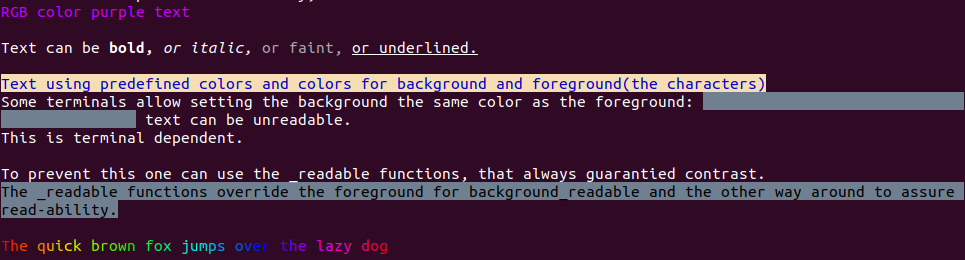
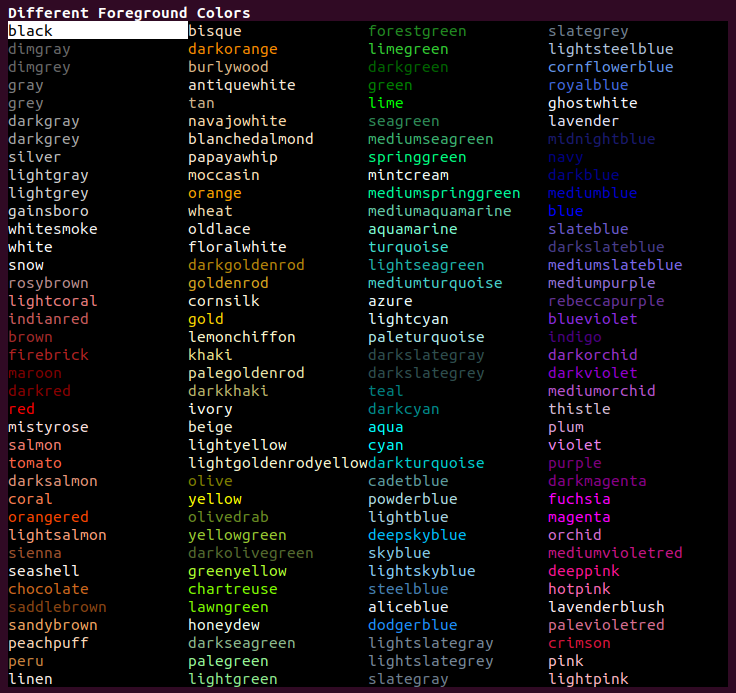
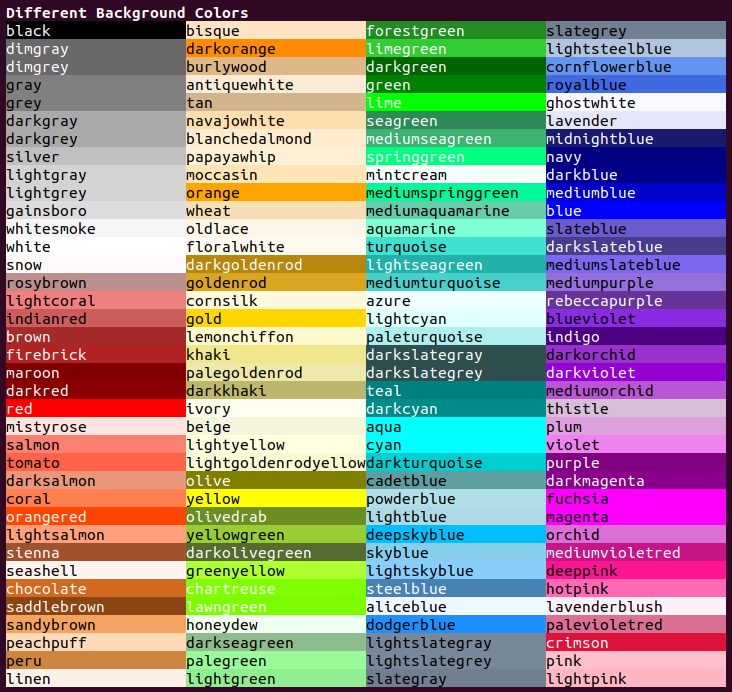

# Colors for the terminal using ANSI color escape sequences

Background info:
* https://stackoverflow.com/questions/4842424/list-of-ansi-color-escape-sequences
* https://chrisyeh96.github.io/2020/03/28/terminal-colors.html

## Similar Libraries

* https://github.com/illyigan/simple_term_colors
* https://github.com/agauniyal/rang

## Purpose

* Intended to be used in simple console drawing applications similar to https://github.com/asciimoo/drawille
* header only, minimal dependencies
* pre defined useful colors taken from matplotlib

## Run the example

```bash
bazel run //terminal_colors:terminal_colors_example
```

## Example output






